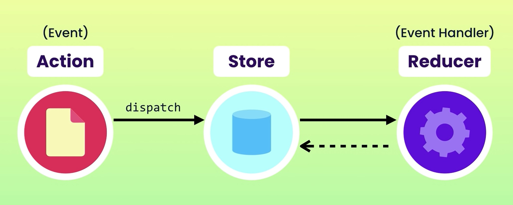

# react-redux

Learning how to use react-redux - a state management library

## What is Redux?

Redux is a state management library for JS apps.

It centralizes application's state, and hence makes data flow transparent and predictable.

## Why is Redux needed?

In certain applications with complex UI (e.g. think of a webpage with 5 components), sometimes state/data is needed to be passed on from one component to another.

It can get very difficult to keep track on the flow of the state/data from one component to the other.

Using Redux, we store all the application state in a central repository which essentially is a Javascript object called the 'store'.

Hence different pieces of UI will no longer need to maintain their own state. They instead get what they need from the store.

Any updates to the state/data in the store is done there (at the store) directly.

## When is Redux NOT NEEDED?

Before using Redux in your projects, think whether you really need redux or not first, before introducing it into your codebase.

Redux is generally not needed for:

- Small to medium-size apps, with simple UI or data flow
- Tight budget or tight deadlines (Redux introduces additional complexity to your code)
- Static data (e.g. fetch data from API and display it)

## Redux Architecture

## Useful extension

Redux Devtools is a useful chrome extension to debug redux apps.

It can show you:

- **a) your application's state tree**,
- **b) actions performed in the app (left side)**,
- **c) and if you select a particular action, and click on the 'action' tab, you can see the data associated with that particular action**,
- **d) Go back to a previous action and restore the UI in that state (time travel debugging)**

## References

Mosh's Youtube Tutorial - Redux Crash Course: https://www.youtube.com/watch?v=poQXNp9ItL4
